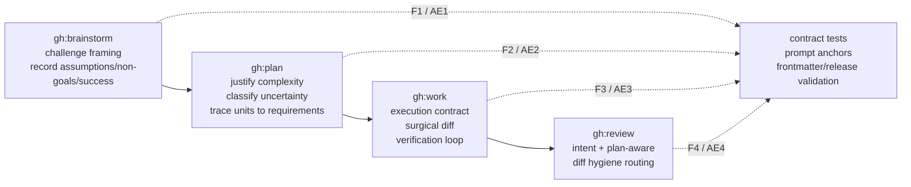

# feat: Integrate Karpathy workflow guardrails

## Overview

本计划把 `forrestchang/andrej-karpathy-skills` 的四条行为准则转译为 GaleHarnessCLI 的阶段化 guardrails，分别落到 `gh:brainstorm`、`gh:plan`、`gh:work`、`gh:review` 的现有流程里。目标不是新增一个用户必须记得调用的 `karpathy-guidelines` skill，也不是同步或复制外部仓库，而是在高频 workflow 内部约束 LLM 的四类失败：错题、过度设计、跑偏实现、无关 diff。

实施策略保持 v1 小而可验证：优先在现有 skill 的关键阶段插入简短规则、测试这些规则不会被后续重构删掉，并把用户可见行为更新到 README。实现阶段应打开 origin 文档的 Source References，对照原版四原则与示例，但所有内容必须服从本仓库的 skill 自包含、跨平台转换和 right-size 约束。

---

## Problem Frame

GaleHarnessCLI 已经把工程工作拆成 `brainstorm -> plan -> work -> review`，但 LLM 常见失败往往跨阶段发生：需求阶段接受错误 framing，计划阶段引入 speculative abstraction，执行阶段顺手改相邻代码，审查阶段只看 bug 而忽略无需求依据的 diff。需求文档已经决定把 Karpathy guidelines 作为全流程 guardrails 融入现有 workflow，而不是单点 `gh:work` 改造或外部 skill 搬运（see origin: `docs/brainstorms/2026-04-24-karpathy-guidelines-integration-requirements.md`）。

---

## Requirements Trace

- R1. 将 Karpathy guidelines 转译为 GaleHarnessCLI 分阶段 guardrails，不复制外部 `CLAUDE.md`，不新增默认主流程之外的独立 skill。
- R2. 阶段职责必须清晰：`gh:brainstorm` 管问题框架和需求边界，`gh:plan` 管复杂度和 traceability，`gh:work` 管 surgical changes 和验证闭环，`gh:review` 管 diff hygiene。
- R3. 保持 right-size：简单任务不能被强制加入冗长仪式，高歧义任务必须显式记录假设和边界。
- R4-R6. `gh:brainstorm` 必须挑战用户原始 framing，并产出能区分需求、非目标、假设、成功标准、产品决策和 planning 问题的 requirements doc。
- R7-R9. `gh:plan` 必须让复杂度有需求依据，显式分类不确定性，并保持 implementation unit 到 requirement / acceptance example 的 traceability。
- R10-R12. `gh:work` 必须在非 trivial 任务前形成轻量执行契约，约束 surgical changes，并把完成判断绑定到验证标准。
- R13-R15. `gh:review` 必须识别 diff hygiene 问题，区分必要清理和无关清理，并按现有 routing 模型分类。
- R16-R18. 变更必须保持 skill 自包含、description 简短、跨 Claude/Codex/OpenCode/Gemini 等平台可转换。
- R19. 如果修改 plugin skill 或用户可见 workflow 行为，必须更新相关文档并运行插件一致性验证。

**Origin actors:** A1 使用 GaleHarnessCLI 的工程师；A2 workflow orchestrator；A3 reviewer personas；A4 后续 planner / worker。

**Origin flows:** F1 Brainstorm 阶段防错题；F2 Plan 阶段防过度设计；F3 Work 阶段防跑偏实现；F4 Review 阶段抓无关 diff。

**Origin acceptance examples:** AE1 covers R4/R5；AE2 covers R7/R9；AE3 covers R10/R11/R12；AE4 covers R13/R14/R15；AE5 covers R16/R18。

---

## Scope Boundaries

- 不 vendor、fork、同步或运行时依赖 `forrestchang/andrej-karpathy-skills`。
- 不把外部 `CLAUDE.md` 原文追加到 `AGENTS.md` 或所有 skill prompt。
- 不新增默认主流程里的独立 `karpathy-guidelines` skill。
- 不引入跨 skill 相对路径、绝对路径、平台专属变量或只在 Claude Code 生效的机制。
- 不把大量规则塞进 frontmatter `description`；description 只保留发现和触发语义。
- 不改变 `gh:` workflow 阶段顺序，也不把 brainstorm/plan/work/review 合并成单一流程。
- 不要求 trivial / 已清晰任务先提问或打印长 checklist。
- 不在 v1 建完整 fixture suite 或重写 reviewer prompt 架构。

### Deferred to Follow-Up Work

- 更系统的 fixture suite：如未来发现 prompt drift 频繁，再为四阶段 guardrails 增加更丰富的 sample skill conversion fixture。
- 独立 reviewer persona：只有当现有 maintainability/project-standards/synthesis 不能稳定抓 diff hygiene 时，再考虑新增 persona。
- 跨 skill 共享参考文件：只有当 guardrail 内容增长到多处重复维护成本明显时，再评估每个 skill 内复制 self-contained reference 的方案。

---

## Context & Research

### Relevant Code and Patterns

- `plugins/galeharness-cli/skills/gh-brainstorm/SKILL.md` 已有 Product Pressure Test、right-size、requirements capture/handoff reference 分离，适合插入“challenge framing but do not bulldoze intent”的阶段规则。
- `plugins/galeharness-cli/skills/gh-brainstorm/references/requirements-capture.md` 是 requirements doc 模板和 completeness check 的真实落点，适合强化 assumptions / non-goals / success criteria / planning handoff。
- `plugins/galeharness-cli/skills/gh-plan/SKILL.md` 已有 plan quality bar、complexity/right-size、implementation units、test scenario 规则，适合加入“每个复杂度来源必须有 requirement/risk/constraint 依据”的 planning gate。
- `plugins/galeharness-cli/skills/gh-work/SKILL.md` 已在 Phase 0/1 读取 plan、scope boundaries、execution note 和 verification，适合增加非 trivial work contract 和 surgical changes 约束。
- `plugins/galeharness-cli/skills/gh-work-beta/SKILL.md` 是用户可见 work 变体；若它复制 stable work 的执行语义，应同步同一 guardrail，避免 beta 用户绕过核心约束。
- `plugins/galeharness-cli/skills/gh-review/SKILL.md` 已有 intent discovery、plan discovery、always-on maintainability/project-standards personas、routing 和 synthesis rules；diff hygiene 应优先落到 Stage 2/2b/5 synthesis，而不是新增 reviewer。
- `plugins/galeharness-cli/agents/maintainability-reviewer.md` 已能抓 premature abstraction / unnecessary indirection / dead code，但需要 plan/intent-aware 边界时应由 `gh-review` synthesis 补足。
- `plugins/galeharness-cli/agents/project-standards-reviewer.md` 已负责 AGENTS/CLAUDE portability、自包含、frontmatter 等显式标准，是 AE5 的主要审查入口。
- `tests/pipeline-review-contract.test.ts` 和 `tests/review-skill-contract.test.ts` 适合承载 skill prompt contract 回归测试。
- `tests/frontmatter.test.ts` 已检查 skill description 1024 字符限制，能防止 R17 相关回归。

### Institutional Learnings

- `docs/solutions/integration-issues/codex-skill-description-limit-2026-04-24.md`：Codex copied skill 的 frontmatter 有实际限制，规则内容不应塞进 `description`。
- `docs/solutions/skill-design/pass-paths-not-content-to-subagents-2026-03-26.md`：orchestrator 设计要避免无谓地读取/传递大量内容；这支持 v1 用简短内嵌规则，而不是跨流程灌入完整外部 Markdown。
- `docs/solutions/plugin-versioning-requirements.md`：plugin 内容变化要更新 substantive docs，但不要手动 bump release-owned version 或 changelog。
- HKTMemory 返回了本需求本身、平台能力 manifest 工作和 Windows 兼容历史；其中平台能力相关经验提示跨平台转换约束要在计划和测试里显式保留。

### External References

- 原版 README：`https://github.com/forrestchang/andrej-karpathy-skills/blob/main/README.md`
- 原版 `CLAUDE.md`：`https://github.com/forrestchang/andrej-karpathy-skills/blob/main/CLAUDE.md`
- 原版 skill：`https://github.com/forrestchang/andrej-karpathy-skills/blob/main/skills/karpathy-guidelines/SKILL.md`
- 原版示例：`https://github.com/forrestchang/andrej-karpathy-skills/blob/main/EXAMPLES.md`

这些外部源确认四原则是 Think Before Coding、Simplicity First、Surgical Changes、Goal-Driven Execution，并明确简单任务要保留 judgment。它们是设计输入，不是要复制的 prompt 内容。

---

## Key Technical Decisions

- **按阶段内嵌最小 guardrails，而不是新增共享外部 skill。** 这样用户不需要额外调用，也避免跨 skill 引用和转换问题。
- **v1 不新增 reviewer persona。** `gh:review` 已有 maintainability、project-standards、plan discovery、synthesis routing；先增强 intent/plan-aware diff hygiene，再用 review contract tests 锁住行为。
- **不创建跨 skill shared reference。** 本仓库要求 skill 目录自包含；v1 的规则足够短，直接放到各自最相关阶段比共享文件更稳。
- **同步 stable `gh:work` 和 beta work 变体的核心约束。** 如果 `gh-work-beta` 继续作为用户入口存在，它不应绕过 surgical changes 和 verification contract。
- **测试以 prompt contract 为主，端到端转换为辅。** 这次不改 converter 行为，重点验证 skill 内容中存在关键 guardrail anchors，外加现有 frontmatter/release validation 覆盖跨平台约束。
- **执行阶段必须对照 origin 的 Source References。** 实现不需要再次做外部调研，但要打开原版 Markdown，确认转译没有偏离四原则。

---

## Open Questions

### Resolved During Planning

- 共享 guardrail 内容应内联还是放 co-located reference？决议：v1 直接内联到每个相关 skill 的关键阶段；不建跨 skill shared reference，避免自包含和转换风险。
- `gh:review` diff hygiene 放在哪里？决议：放在 `gh-review` 的 intent/plan discovery、reviewer prompt context 和 synthesis/routing 规则；必要时轻触 maintainability/project-standards persona，但不新增 persona。
- 哪些 docs 需要更新？决议：更新 `plugins/galeharness-cli/README.md` 的核心 workflow 描述即可；不改 release-owned version/changelog。

### Deferred to Implementation

- 每个 guardrail 段落的最终 wording：实现时根据周围 prompt 风格微调，但必须保留本计划的行为锚点和 right-size 约束。
- `gh-work-beta` 与 `gh-work` 的具体同步范围：实现时先比较两者当前差异，只同步核心 contract，不顺手重排 beta 特有 delegation 文档。
- 具体 contract test 断言字符串：实现时选择稳定短语，避免测试过度绑定整段 prose。

---

## High-Level Technical Design

> *This illustrates the intended approach and is directional guidance for review, not implementation specification. The implementing agent should treat it as context, not code to reproduce.*

---

## Implementation Units

- U1. **Add brainstorm framing guardrails**

**Goal:** 让 `gh:brainstorm` 在需求探索阶段显式挑战 framing、记录假设/非目标/成功标准，并避免把未经确认的技术方案写成产品需求。

**Requirements:** R1, R2, R3, R4, R5, R6; F1; AE1.

**Dependencies:** None.

**Files:**
- Modify: `plugins/galeharness-cli/skills/gh-brainstorm/SKILL.md`
- Modify: `plugins/galeharness-cli/skills/gh-brainstorm/references/requirements-capture.md`
- Test: `tests/pipeline-review-contract.test.ts`

**Approach:**
- 在 Core Principles 或 Product Pressure Test 附近加入简短 guardrail：先确认真实问题、列明关键假设、必要时提出更简单/更高杠杆 framing，但不能替用户强行改题。
- 在 requirements capture checklist 中强化：需求、非目标、假设、成功标准、产品决策和 deferred planning question 必须分开。
- 不把原版 Markdown 长段落复制进 skill，只转译成符合现有 brainstorm 风格的阶段规则。

**Patterns to follow:**
- `plugins/galeharness-cli/skills/gh-brainstorm/SKILL.md` 的 `1.2 Product Pressure Test`
- `plugins/galeharness-cli/skills/gh-brainstorm/references/requirements-capture.md` 的 finalization checklist
- `tests/pipeline-review-contract.test.ts` 中现有 prompt contract tests

**Test scenarios:**
- Covers AE1. Happy path: 读取 `gh-brainstorm/SKILL.md`，断言包含挑战 framing、显式假设、非目标/成功标准的稳定短语。
- Happy path: 读取 `requirements-capture.md`，断言模板或 checklist 明确防止把未经确认的实现方案写成需求。
- Edge case: 断言新增文本仍保留 right-size / lightweight 快速路径，避免把所有 brainstorm 变成长流程。

**Verification:**
- `gh:brainstorm` 的规则能告诉 planner 哪些是产品决策，哪些只是 planning/research 问题。
- Contract tests 覆盖新增行为锚点，且不依赖整段文案逐字匹配。

---

- U2. **Add planning complexity and uncertainty gates**

**Goal:** 让 `gh:plan` 在实施计划阶段检查复杂度来源是否有需求依据，并把不确定性分类为 blocker、assumption、deferred technical question 或 implementation-time unknown。

**Requirements:** R1, R2, R3, R6, R7, R8, R9; F2; AE2.

**Dependencies:** U1.

**Files:**
- Modify: `plugins/galeharness-cli/skills/gh-plan/SKILL.md`
- Test: `tests/pipeline-review-contract.test.ts`

**Approach:**
- 在 Plan Quality Bar、Phase 2 或 implementation unit 定义处加入 complexity justification gate：新增 abstraction/config/target/agent/pipeline/error layer 时必须能追溯到 requirement、success criteria、risk 或明确约束。
- 强化不确定性分类，避免 planner 把 execution-time unknown 伪装成已经决定的设计。
- 保持 `gh:plan` 对执行策略中立，不加入 `gh:work` 或 beta-only 调用细节。

**Patterns to follow:**
- `plugins/galeharness-cli/skills/gh-plan/SKILL.md` 的 Core Principles、Plan Quality Bar、Phase 2、Phase 3.5
- `tests/pipeline-review-contract.test.ts` 的 `gh:plan remains neutral during gh:work-beta rollout`

**Test scenarios:**
- Covers AE2. Happy path: 读取 `gh-plan/SKILL.md`，断言复杂度来源必须有 requirement/risk/constraint 依据。
- Happy path: 读取 `gh-plan/SKILL.md`，断言 unknown classification 覆盖 blocker、assumption、deferred technical question、implementation-time unknown。
- Edge case: 断言 `gh-plan/SKILL.md` 不引入 beta-only execution target 或具体 `gh:work` 调用编排。

**Verification:**
- 计划生成后，每个 feature-bearing unit 都能追溯到 requirements 或 success criteria。
- 新增 planning guardrails 没有把 plan 变成 implementation choreography。

---

- U3. **Add work execution contract and surgical-change rules**

**Goal:** 让 `gh:work` 在非 trivial 任务开工前形成轻量执行契约，并在执行中用最小可行改动、明确非目标和验证标准约束 diff。

**Requirements:** R1, R2, R3, R10, R11, R12; F3; AE3.

**Dependencies:** U2.

**Files:**
- Modify: `plugins/galeharness-cli/skills/gh-work/SKILL.md`
- Modify: `plugins/galeharness-cli/skills/gh-work-beta/SKILL.md`
- Test: `tests/pipeline-review-contract.test.ts`

**Approach:**
- 在 `gh-work` Phase 0/1 的 plan reading 和 bare prompt triage 后加入 non-trivial execution contract：当前假设、最小可行改动、明确非目标、验证标准。
- 加入 surgical changes 规则：不主动改相邻代码、注释、格式或架构；只清理由本次改动制造的 orphan；发现 pre-existing 问题时报告而不是顺手修。
- 将同一核心约束同步到 `gh-work-beta`，但不改 beta delegation 语义。

**Patterns to follow:**
- `plugins/galeharness-cli/skills/gh-work/SKILL.md` 的 Phase 0 Input Triage、Phase 1 Quick Start
- `plugins/galeharness-cli/skills/gh-work-beta/SKILL.md` 的对应阶段
- 原版 Surgical Changes 和 Goal-Driven Execution 示例，用作转译校准，不逐字复制

**Test scenarios:**
- Covers AE3. Happy path: 读取 `gh-work/SKILL.md`，断言非 trivial work contract 包含 assumptions、minimal change、non-goals、verification。
- Happy path: 读取 `gh-work/SKILL.md` 和 `gh-work-beta/SKILL.md`，断言两者都包含 surgical changes 核心约束。
- Edge case: 断言规则允许清理由本次改动制造的 unused imports/variables/functions，但不允许删除 pre-existing dead code。
- Integration: 断言 `gh:work` 仍读取 plan 的 Scope Boundaries、Execution note 和 Verification，不用新的 contract 替代 plan。

**Verification:**
- Worker 可以从 plan 或 bare prompt 得到明确完成标准，而不是用“看起来可以”结束。
- Stable 和 beta work 入口在核心 diff hygiene 约束上保持一致。

---

- U4. **Add review diff hygiene synthesis**

**Goal:** 让 `gh:review` 能识别无关重构、speculative abstraction、未要求行为变化、相邻格式化和无需求依据的文件改动，并按现有 routing 模型输出。

**Requirements:** R1, R2, R9, R13, R14, R15; F4; AE4, AE5.

**Dependencies:** U2, U3.

**Files:**
- Modify: `plugins/galeharness-cli/skills/gh-review/SKILL.md`
- Modify: `plugins/galeharness-cli/agents/maintainability-reviewer.md`
- Modify: `plugins/galeharness-cli/agents/project-standards-reviewer.md`
- Test: `tests/review-skill-contract.test.ts`

**Approach:**
- 在 `gh-review` Stage 2 intent discovery / Stage 2b plan discovery 后加入 diff hygiene framing：reviewers 和 synthesis 要比较 diff、intent、plan/requirements，识别没有依据的改动。
- 在 Stage 5 routing 附近明确：确定性、本地可修复的无关 diff 可走 `safe_auto`；涉及 scope、行为或设计取舍的 diff hygiene 问题走 `gated_auto`、`manual` 或 `advisory`。
- 轻触 maintainability reviewer，让其在 premature abstraction 判断中区分“需求支撑的复杂性”和“speculative abstraction”。
- 轻触 project-standards reviewer，让其继续负责 skill 自包含、cross-platform portability、description 限制等显式标准；不要让它审查泛化的 Karpathy 偏好。

**Patterns to follow:**
- `plugins/galeharness-cli/skills/gh-review/SKILL.md` 的 Stage 2、Stage 2b、Stage 5、Action Routing
- `plugins/galeharness-cli/agents/maintainability-reviewer.md` 的 confidence calibration
- `plugins/galeharness-cli/agents/project-standards-reviewer.md` 的 evidence requirements
- `plugins/galeharness-cli/skills/gh-review/references/persona-catalog.md`

**Test scenarios:**
- Covers AE4. Happy path: 读取 `gh-review/SKILL.md`，断言 review 会检查 diff 是否能追溯到 intent/plan/requirements。
- Happy path: 读取 `gh-review/SKILL.md`，断言 diff hygiene 问题按 `safe_auto`、`gated_auto`、`manual`、`advisory` 的现有 routing 分类。
- Covers AE5. Edge case: 读取 `project-standards-reviewer.md`，断言 cross-platform portability 和 skill 自包含仍由项目标准驱动，而不是泛化偏好。
- Edge case: 读取 `maintainability-reviewer.md`，断言不 flag 由真实需求支撑的复杂度，只 flag 未证明的 abstraction / indirection。

**Verification:**
- `gh:review` 不需要新 persona 也能把“这可能能工作，但不该在这个 diff 里出现”的问题表达清楚。
- Routing 仍服从现有 confidence gate 和 fixer policy。

---

- U5. **Update plugin docs and validation contracts**

**Goal:** 更新用户可见文档和回归测试，确保 guardrails 在转换、安装和后续 release validation 中稳定。

**Requirements:** R16, R17, R18, R19; AE5.

**Dependencies:** U1, U2, U3, U4.

**Files:**
- Modify: `plugins/galeharness-cli/README.md`
- Modify: `tests/pipeline-review-contract.test.ts`
- Modify: `tests/review-skill-contract.test.ts`
- Test: `tests/frontmatter.test.ts`
- Test: `tests/codex-writer.test.ts`

**Approach:**
- 在 README 的 Core Workflow 描述中简短说明 `gh:` workflow 会内置假设、范围、surgical diff 和验证 guardrails；不要扩大 component count 或 release-owned metadata。
- 在 contract tests 中加入稳定 anchor，覆盖四阶段 guardrails、work/beta 同步、review diff hygiene 和 plan neutrality。
- 依赖现有 `frontmatter.test.ts` 防 description 过长；如实现没有触碰 converter 行为，不新增 writer 逻辑测试。
- 运行 full test suite 和 release validation，确保 plugin inventory、frontmatter、cross-platform conversion 语义稳定。

**Patterns to follow:**
- `plugins/galeharness-cli/README.md` 的 Core Workflow 表格
- `tests/pipeline-review-contract.test.ts`
- `tests/review-skill-contract.test.ts`
- `docs/solutions/plugin-versioning-requirements.md`
- `docs/solutions/integration-issues/codex-skill-description-limit-2026-04-24.md`

**Test scenarios:**
- Happy path: README 描述更新后，核心 skill 列表和 component counts 不被无关改动影响。
- Happy path: `tests/frontmatter.test.ts` 继续证明所有 skill description 不超过 1024 字符。
- Integration: `bun test` 覆盖 prompt contract、frontmatter 和 writer/converter 现有回归。
- Integration: `bun run release:validate` 通过，证明 plugin metadata 和 marketplace surfaces 仍一致。

**Verification:**
- 用户能从 README 理解 workflow 内置了 guardrails，但不会误以为新增了独立 command。
- 没有手动 bump plugin version、marketplace version 或 root changelog。

---

## System-Wide Impact

- **Interaction graph:** 需求影响 `gh:brainstorm -> gh:plan -> gh:work -> gh:review` 的 handoff 语义；每阶段应消费前阶段的边界，而不是重新发明目标。
- **Error propagation:** 这不是运行时错误处理变更；“错误”主要体现为 workflow 输出偏离需求。计划通过 assumptions/non-goals/verification/routing 让偏离更早暴露。
- **State lifecycle risks:** plan 和 requirements 是 durable docs；执行进度仍由 git 和 `gh:work` task state 承载，不把进度写回 plan body。
- **API surface parity:** 这是 plugin skill 行为变化，不改 CLI flags/API；但所有目标平台安装后的 skill 内容都应保持可理解和可转换。
- **Integration coverage:** 单个 skill 的 prose 测试不足以证明闭环；contract tests 要覆盖四个阶段和 README/validation。
- **Unchanged invariants:** 不改变 `gh:` 技能名称、触发方式、frontmatter schema、release-owned versioning、converter output paths、review routing enum。

---

## Risks & Dependencies

| Risk | Mitigation |
|------|------------|
| Prompt 变长导致简单任务变慢 | 每阶段只加短规则，并明确 right-size / trivial 快速路径 |
| 把外部 Markdown 复制过多，造成 license/维护/风格问题 | 只保留 URL 和转译后的行为锚点，不逐字搬运长段落 |
| `gh:review` 新规则产生泛化噪音 | 让 synthesis 根据 intent/plan/requirements 判断 diff hygiene，并保持 confidence/routing gate |
| `gh-work` 和 `gh-work-beta` 漂移 | U3 同步核心 contract，contract test 同时读两个文件 |
| skill 自包含或跨平台转换被破坏 | 不建跨 skill reference；用 project-standards reviewer 和 release validation 检查 |
| Tests 过度绑定 prose | 使用短 anchor phrase，不断言整段文案 |

---

## Documentation / Operational Notes

- 更新 `plugins/galeharness-cli/README.md`，说明核心 workflow 内置阶段化 guardrails。
- 不更新 root `CHANGELOG.md`，不手动 bump `plugins/galeharness-cli/.claude-plugin/plugin.json` 或 `.claude-plugin/marketplace.json`。
- 实现完成后运行 `bun test`；因为修改 plugin skills/agents/README，还运行 `bun run release:validate`。
- PR 描述应链接本计划和 origin requirements，并包含原版 Markdown links，方便 review 对照设计输入。

---

## Alternative Approaches Considered

- **新增独立 `karpathy-guidelines` skill：** 拒绝。用户不会自然在每次 workflow 前手动调用，且需求明确要求融入 GaleHarnessCLI 高频流程。
- **建立共享 `references/karpathy-guidelines.md` 并由四个 skills 引用：** 暂缓。跨 skill 共享会触碰自包含和转换约束；v1 内容较短，直接内联更稳。
- **新增 diff-hygiene reviewer persona：** 暂缓。现有 maintainability/project-standards/synthesis 已覆盖大部分能力，先增强 orchestrator 规则更小。
- **只改 `gh:work`：** 拒绝。用户已指出 brainstorm/plan 阶段同样需要约束；错误 framing 和过度设计在执行前就会发生。

---

## Success Metrics

- 后续 `gh:brainstorm` requirements doc 更稳定地产出 assumptions、non-goals、success criteria 和 planning handoff。
- 后续 `gh:plan` 的 implementation units 能说明复杂度依据，并显式分类 unknowns。
- 后续 `gh:work` 在非 trivial 任务中更少出现 drive-by refactor 和相邻格式化。
- 后续 `gh:review` 能报告无需求依据的 diff hygiene 问题，并按现有 routing 输出。
- `bun test` 和 `bun run release:validate` 通过，且没有 release-owned metadata churn。

---

## Sources & References

- **Origin document:** [docs/brainstorms/2026-04-24-karpathy-guidelines-integration-requirements.md](docs/brainstorms/2026-04-24-karpathy-guidelines-integration-requirements.md)
- Related code: `plugins/galeharness-cli/skills/gh-brainstorm/SKILL.md`
- Related code: `plugins/galeharness-cli/skills/gh-plan/SKILL.md`
- Related code: `plugins/galeharness-cli/skills/gh-work/SKILL.md`
- Related code: `plugins/galeharness-cli/skills/gh-work-beta/SKILL.md`
- Related code: `plugins/galeharness-cli/skills/gh-review/SKILL.md`
- Related code: `plugins/galeharness-cli/agents/maintainability-reviewer.md`
- Related code: `plugins/galeharness-cli/agents/project-standards-reviewer.md`
- Related tests: `tests/pipeline-review-contract.test.ts`
- Related tests: `tests/review-skill-contract.test.ts`
- Related tests: `tests/frontmatter.test.ts`
- Institutional learning: `docs/solutions/integration-issues/codex-skill-description-limit-2026-04-24.md`
- Institutional learning: `docs/solutions/skill-design/pass-paths-not-content-to-subagents-2026-03-26.md`
- Institutional learning: `docs/solutions/plugin-versioning-requirements.md`
- External docs: `https://github.com/forrestchang/andrej-karpathy-skills/blob/main/README.md`
- External docs: `https://github.com/forrestchang/andrej-karpathy-skills/blob/main/CLAUDE.md`
- External docs: `https://github.com/forrestchang/andrej-karpathy-skills/blob/main/skills/karpathy-guidelines/SKILL.md`
- External docs: `https://github.com/forrestchang/andrej-karpathy-skills/blob/main/EXAMPLES.md`
